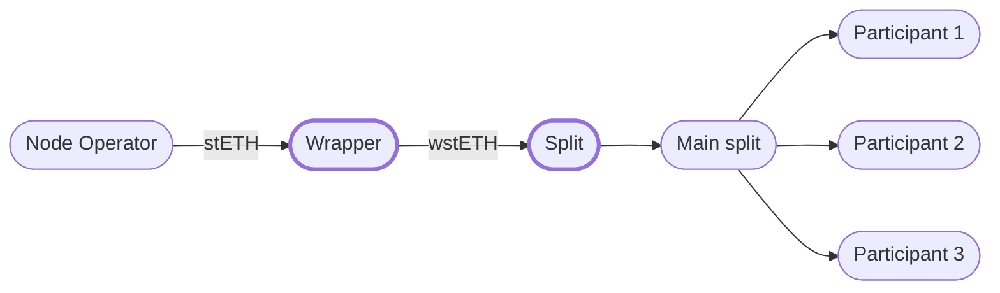

# Split Contracts Deployment UI

Simple UI for deploying split contracts that automate the rewards distribution among participants for Lido Simple DVT module. Deployed contracts are chained, which wraps the stETH rewards in wstETH and then distributes them to the cluster participants.

Deployed UI is available on Vercel: https://simple-dvt-split.vercel.app/

## Reward Distribution

The contracts to be deployed assume the following scheme of rewards distribution among cluster members:



## Deployable Contracts

The UI allows deploying 2 contracts from factories:

**Split Сontract**. A contract that distributes rewards to participants. It uses the 0xSplit factory [0x2ed6c4B5dA6378c7897AC67Ba9e43102Feb694EE](https://etherscan.io/address/0x2ed6c4B5dA6378c7897AC67Ba9e43102Feb694EE) for contract deployment.

**Wrapper Contract**. The contract that is specified as the `rewardAddress` of a node operator. Wraps `stETH` rewards to `wstETH` and sends it to the split contract.

Useful links:

- [splits.org](https://splits.org/)
- [splits repository](https://github.com/0xSplits/splits-contracts)
- [splits audit report](https://github.com/0xSplits/splits-contracts/blob/main/audit/0xSplits_A-1.pdf)
- [splits factory](https://etherscan.io/address/0x2ed6c4B5dA6378c7897AC67Ba9e43102Feb694EE)
- [wrapper repository](https://github.com/ObolNetwork/obol-splits)
- [wrapper audit report](https://github.com/ObolNetwork/obol-splits/blob/main/audit/Obol%20Audit%20Report.pdf)

## Usage

**Install dependencies**. The project uses [yarn](https://yarnpkg.com/) as a dependency manager. First you need to install the dependencies by running the following command:

```bash
yarn install
```

**Build**. To build the UI, use the command:

```bash
yarn build
```

The project source files will be transpiled and placed in the `dist` directory. These files can be used for publishing.

**Start**. To start the UI on the test server locally, use the command:

```bash
yarn start
```

The UI will be available at http://localhost:8000.

## License

The code in this repository is distributed under the terms of the MIT license.

## Disclaimer of Warranty

There is no warranty for the code provided in this repository, to the extent permitted by applicable law. The code is provided "as is" without warranty of any kind, either expressed or implied, including, but not limited to, the implied warranties of merchantability and fitness for a particular purpose. The entire risk as to the quality and performance of the code is with you. Should the code prove defective, you assume the cost of all necessary servicing, repair, or correction.

In no event unless required by applicable law or agreed to in writing will the author, or any other party who modifies and/or conveys the code as permitted by the license, be liable to you for damages, including any general, special, incidental, or consequential damages arising out of the use or inability to use the code (including but not limited to loss of data or data being rendered inaccurate, or losses sustained by you or third parties, or a failure of the code to operate with any other programs), even if such holder or other party has been advised of the possibility of such damages.
